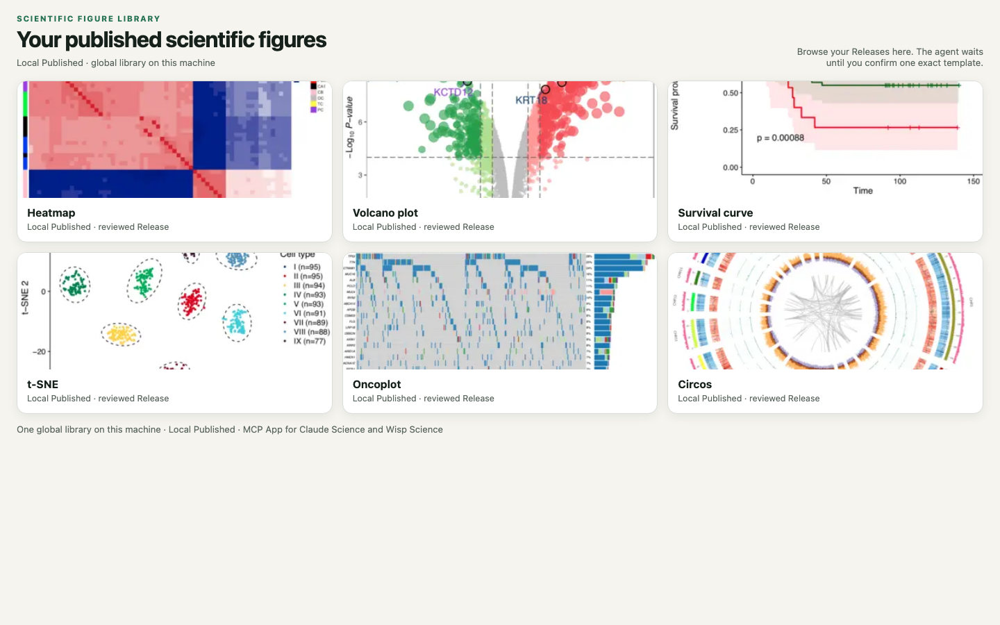

<p align="center">
  
</p>

# Scientific Figure Library

[Website](https://xuzhougeng.github.io/ScientificFigureLibrary/) ·
[简体中文](README.zh-CN.md) ·
[Quickstart](docs/QUICKSTART.md) ·
[Protocol](docs/PROTOCOL.md) ·
[Releases](https://github.com/xuzhougeng/ScientificFigureLibrary/releases) ·
[Wisp Science](https://github.com/xuzhougeng/wisp-science)

Scientific Figure Library (SFL) is a **local-first MCP server and MCP App** for
**your scientific figures**. You import a figure and its code, review them,
publish an immutable Release to **one global Library on your machine**, then
reuse that exact template across projects in **Claude Science**, **Wisp Science**,
**Codex**, and other stdio MCP hosts.

The Library stays on disk you choose. Nothing is copied into every project
until you confirm a materialization. The server does **not** execute plotting
code and does not contain a second model: the host agent inspects files; SFL
hashes, versions, gates, and publishes them.

The default retrieval order is **Local Published → FigureYa → Personal Figure
Modules → enabled dynamic personal Providers**. The bundled Community snapshot
is retained for explicit compatibility, but is frozen and excluded from default
search (`includeInDefaultSearch: false`). The source of truth for your own
figures is always **Local Published**.

A bundled extra catalog may currently contain zero releases after an authorized
redaction; that is a healthy empty source, not a failure, and default search
continues across other providers.

<p align="center">
  
</p>

<p align="center"><em>Search your local published library in the MCP App, confirm one exact template, then materialize it into a project.</em></p>

## Install with a coding agent

Give Claude Code, Codex, or another local coding agent with terminal access
this repository and the following request:

```text
Install Scientific Figure Library from
https://github.com/xuzhougeng/ScientificFigureLibrary.

Follow docs/QUICKSTART.md. Prefer a GitHub Release ZIP when one is published.
Node.js 22+ is required. Register the stdio MCP server as figure-library
pointing at dist/index.js. For Wisp Science, use npm run package:wisp and
install the generated plugin. Bind one global Library directory on disk.
Do not execute user plotting code. First test: source_status, bind if needed,
open the workbench, search the local published library.
Tell me when I need to grant folder access or start a new host session.
```

Manual steps: [docs/QUICKSTART.md](docs/QUICKSTART.md).

## What is included

- **Local Published library** — one user-selected directory, shared across
  projects and hosts
- Direct **image + code intake**, review gates, immutable Revisions and Releases
- MCP App gallery: browse, exact preview, user confirmation
- Search, describe, preview, then **materialize** an exact confirmed template
- Portable backup / restore / fork of the Library
- Optional extra search providers; they do not replace local review
- **Open Figure Modules** — an openly collaborative, bundled offline Catalog
  and thumbnail snapshot. Complete module ZIPs are fetched only for one exact
  user-selected commit-pinned materialization and are never bundled in the
  plugin.

## First success

```text
Call figure_library_source_status. If writes are disabled, help me bind one
absolute global Library directory (plan then apply after I confirm the path).
Open the workbench and search my Local Published templates. Wait for me to
confirm one card. Then plan materialization into an empty folder I specify.
Do not execute R or Python. Do not redraw the figure.
```

If the local library is empty, import a figure/code pair, review it, and
publish a Release before searching. Full contract: [docs/PROTOCOL.md](docs/PROTOCOL.md).

## Develop from source

Requires Node.js 22+:

```bash
git clone https://github.com/xuzhougeng/ScientificFigureLibrary.git
cd ScientificFigureLibrary
npm ci
npm run check
node dist/index.js
```

```json
{
  "mcpServers": {
    "figure-library": {
      "command": "node",
      "args": ["/absolute/path/to/ScientificFigureLibrary/dist/index.js"]
    }
  }
}
```

The Library locator is machine-local (`locator.json` under AppData / XDG).
`FIGURE_LIBRARY_DIR` is an admin override only.

## Tools (short list)

| Tool | Role |
| --- | --- |
| `figure_library_plan_bind_global` / `apply_bind_global` | Choose the local Library directory |
| `figure_library_open` | Open the MCP App |
| `figure_library_search` | Search Local Published (and any enabled extras) |
| `figure_library_plan_working_revision` / `apply_working_revision` | Import a figure+code unit |
| `figure_library_plan_publish_working_revision` / `apply_publish_working_revision` | Publish a Release |
| `figure_library_plan_open_figure_module_pr` / `apply_open_figure_module_pr` | Optional Open Figure Modules GitHub PR |
| `figure_library_plan_materialize` / `apply_materialize` | Copy a confirmed template into a project |

The server never runs notebooks, installers, or plot scripts. See
[SECURITY.md](SECURITY.md).

## Open Figure Modules

Personal modules use one content repository for both cleaned source modules and
deterministic archives (no second archive repository):

```text
<PERSONAL_MODULE_REPOSITORY>
├── modules/<moduleId>/       # reviewed, cleaned public module
├── archives/<moduleId>.zip  # deterministic ZIP from a pinned source commit
└── catalog/                  # archive manifest and admission records
```

The SFL checkout contains only the derived snapshot under
`assets/personal-modules/`: Catalog, primary-preview/thumbnail manifests,
preview images, thumbnails, and the per-module license notice. It does not
contain complete personal ZIPs, Gallery source/reference images, private data,
credentials, or repository state.

The maintainer commands are offline and deliberately separate from GitHub
operations:

```bash
npm run modules:validate -- --check --repository <PERSONAL_MODULE_REPOSITORY>
npm run modules:archive -- --write --repository <PERSONAL_MODULE_REPOSITORY>
npm run modules:catalog -- --write --repository <PERSONAL_MODULE_REPOSITORY>
npm run modules:source-pack -- --write --repository <PERSONAL_MODULE_REPOSITORY>
```

They do not create commits, push, create repositories, run R, install
dependencies, or modify the Gallery. SFL materialization only downloads
or reads the selected ZIP, validates its bytes and safe paths, extracts the
requested `template`/`full` file set, and writes a lock with
`codeExecutedBySflClient: false`.

## License

MIT for this project's code. User-imported figures keep the license recorded
at import. Optional bundled catalog assets, if used, keep their upstream
licenses. See [THIRD_PARTY_NOTICES.md](THIRD_PARTY_NOTICES.md).
