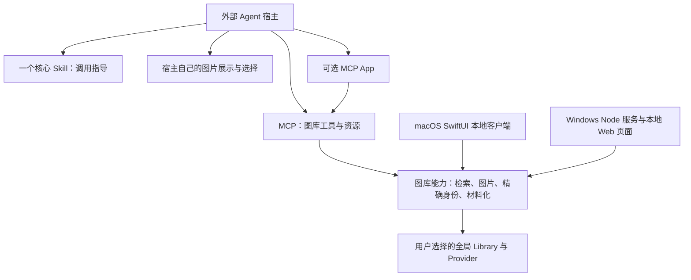

# 外部 Agent 接入方案

状态：2026-09-15，第一阶段已在开发代码中实现；未发布，真实宿主验收待完成。
当前工具参数与确认契约见 [PROTOCOL](PROTOCOL.md)，安装见 [QUICKSTART](QUICKSTART.md)。

## 1. 目标与职责

**SFL 是本地图片—代码知识库客户端，以 MCP 和一个核心 Skill 向外部 CLI/Desktop 提供候选图片列表及资产使用能力。**

目标宿主包括 zcode、WorkBuddy、Claude Desktop、Codex Desktop、Wisp Science 等。
本地客户端采用 macOS 原生 SwiftUI、Windows Node 服务与本地 Web 页面，详见
[本地客户端架构](LOCAL_CLIENT.md)。外部宿主可通过自己的对话、图片控件或 WebView
展示候选图，也可使用面向支持客户端的简化 MCP App。
上述名称表示目标宿主，不代表所有版本均已完成兼容性验收。

SFL 管理可复用资产及其身份、版本、来源。具体研究任务、项目文件组织和绘图执行由
宿主负责；接入调整遵循现有 [产品边界](PRODUCT_PRINCIPLES.md)。

## 2. 第一阶段实现

| 能力 | 当前开发实现 |
| --- | --- |
| 接入 | [入口](../src/index.ts) 提供 stdio MCP；普通调用不要求加载 App HTML |
| 一个 Skill | [figure-library](../skills/figure-library/SKILL.md) 为唯一入口；原 description、organization、style 迁入按需资料，保留许可和辅助源码 |
| 读取指导 | `figure_library_get_skill` 返回同源文本、资料清单、哈希、服务版本、指导内容版本及能力说明；未绑定图库也可读取 |
| 指导资源 | `figure-library://guidance/figure-library/SKILL.md` 与资料清单中的资源返回相同文本 |
| 搜索 | 返回候选 ID、Provider 限定精确选择、可用缩略图 URI 和分页信息；App 专用缩略图保留兼容 |
| 候选图片 | `figure_library_get_candidate_images` 返回 1–12 张有身份标签的标准 MCP 图片；也可按 URI 读取图片资源 |
| 翻页 | `figure_library_search_page` 同时对 Agent 和 App 开放，复用原有不透明游标与过期检查 |
| 精确看图与确认 | 复用 `figure_library_preview_exact_headless` 和 `figure_library_confirm_selection_headless` |
| 材料化 | 复用 receipt、plan/apply、过期状态检查及重放语义 |
| 本地客户端与内置运行时 | macOS SwiftUI、Windows Node/Web 及随包运行时已确定为下一阶段方向，尚未实现；当前插件仍需可调用的 Node.js 22+ |
| 独立 Web 入口与 MCP App 精简 | 当前已有 MCP App 界面，尚未拆出独立网页入口或完成精简；MCP URI 不能直接充当浏览器 URL |

接口分别位于 [guidance.ts](../src/guidance.ts)、[candidate-images.ts](../src/candidate-images.ts)
和 [server.ts](../src/server.ts)。服务初始化说明提示宿主先读取核心 Skill。

## 3. 一个核心 Skill，多种加载方式

支持本地 Skill 的宿主安装 `skills/figure-library/`，保留其按需资料；只配置 MCP 的
宿主调用 `figure_library_get_skill`。后者的 `document` 默认是 `SKILL.md`，读取其他
资料时传入返回清单中的精确 ID。MCP 返回内容与本地文件同源，每个服务会话固定一份
指导快照，提供文件哈希和整体 `guidanceRevision`，不接受任意文件路径。

描述写作、脚本组织、风格检查和不同后端的指导按任务读取。资料中的相对链接在本地
和 MCP 资源 URI 中均可解析。可选 Python 辅助源码与许可证同样可读取；读取不会执行代码。

MCP Resources 可以传递文本或二进制内容，如何纳入模型上下文由宿主决定。因此，
返回 Skill 文本不等于自动安装或激活宿主原生 Skill。
[MCP Resources 规范](https://modelcontextprotocol.io/specification/2025-11-25/server/resources)

## 4. 宿主中的选图流程

1. 读取指导并检查 Library 状态；首次绑定仍按用户明确指定的目录走 Plan/Apply。
2. Agent 根据用户需求搜索，保留 `resultSetId`、`candidateId`、`providerId` 和 `exactSelector`。
3. 宿主读取当前页缩略图并展示。用户要求下一页时使用返回游标，不通过改变查询模拟翻页。
4. 用户在界面或对话中选择，宿主将选择映射回原始候选身份，不能只传标题或序号。
5. Agent 读取并审阅选中候选的精确预览，按用户选择或明确委托完成 headless 确认。
6. 使用一次性 receipt 生成材料化计划，展示具体目标和获取策略；获批后 Apply。
7. 宿主取得准确模板文件，按用户任务和项目约定继续工作。

候选图片的两种表达是标准 MCP `image` 工具结果和可读取的图片资源。MCP 支持这些
表达，但实际显示方式由宿主实现。
[MCP Tools 规范](https://modelcontextprotocol.io/specification/2025-11-25/server/tools)

图片接口接受同一结果集内最多 12 个不重复候选 ID，沿用每图 256 KiB、总计 3 MiB 的
Data URL 上限。返回数据分别记录原始缩略图哈希和传输图片哈希。资料或图片的读取
不产生 preview challenge 或 receipt；过期结果、跨会话和跨结果集候选均不能绕过校验。

缩略图加载、Agent 看图、用户看图和批准写入是不同事实。服务端不能以工具返回成功
证明用户界面已显示图片；材料化成功也不代表绘图已执行或科学结论已验证。

## 5. 本地客户端与外部会话

本地客户端的平台方向已确定：macOS 原生 SwiftUI；Windows 随插件携带 `node.exe`，
启动本地服务并打开 Web 页面。两端共用现有 TypeScript/Node 后端与一个核心 Skill。
0.8.0 已提供独立界面、浏览器连接和运行时分发，并同时提供内置 Node 与复用本机 Node.js 22+ 的安装包。两端的“连接外部工具”页面提供实际路径的 MCP 配置、CLI 命令、核心 Skill 加载方法和验证指令；见 [安装说明](INSTALL_LOCAL.md#外部-mcp-与-skill)。

当前各宿主可启动自己的 stdio MCP 进程并显式绑定同一全局 Library，但各进程拥有
独立会话。结果集、challenge、receipt 和待应用计划不得跨进程传递；选图到 Apply
应保持原 MCP 会话。

Windows Web 客户端通过受限本机 HTTP 服务读取图片和业务数据；图片身份、访问范围与会话有效期仍需保留。跨机器宿主的 localhost 不代表 SFL 所在机器。不要默认把服务器
本地路径放进浏览器的 `img.src`。

具体进程组织、界面连接与选图交接应保持会话隔离和既有确认契约。简化 MCP App 只
承担支持宿主内的候选交互，完整的本地知识库界面由上述两种客户端承接。

## 6. 验证与剩余工作

[普通 MCP 集成测试](../tests/agent-integration.test.ts) 使用隔离临时 Library、配置和
未声明 Apps 扩展的客户端，覆盖指导读取、同源资料链接、候选图资源/工具、分页、
精确确认、材料化和重放。负例包括任意指导路径、重复/跨结果集候选、数量超限、
错误游标、未确认材料化、重复 challenge/receipt、跨会话和图库/目录变更。

构建和 MCP smoke 用于验证代码与 stdio 接入，不能代替真实宿主体验验收。接下来应
为各目标宿主记录版本和配置，分别验证“工具调用成功”“Agent 能读图”“用户能看图”，
再验证选择回传与完整材料化流程。未测试的宿主保留“未验证”状态。
