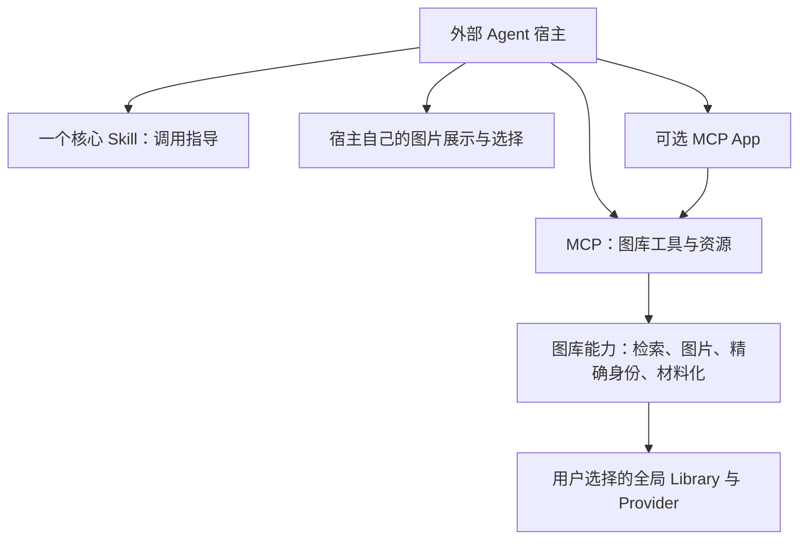

# 外部 Agent 接入方案

状态：2026-09-15 方向记录与实现提案。本文不新增运行时能力；拟议工具名和资源 URI
尚未注册，不可作为当前调用契约。当前契约仍以 [PROTOCOL](PROTOCOL.md) 为准。

## 1. 目标与职责

**SFL 提供图库资产服务、一个核心 Skill 和宿主可调用接口，让外部 Agent 完成选图与后续任务。**

目标宿主包括 zcode、WorkBuddy、Claude Desktop、Codex Desktop、Wisp Science 等。
宿主可以通过自己的对话、图片控件或 WebView 展示候选图，也可以使用 SFL 的 MCP App。
核心选图流程不应要求宿主先成功加载 SFL HTML。

SFL 管理可复用资产及其身份、版本、来源。具体研究任务、项目文件组织和绘图执行由
宿主负责；这次接入调整不扩大 [产品边界](PRODUCT_PRINCIPLES.md)，也不新增项目管理系统。

## 2. 当前实现与缺口

以下根据当前仓库代码核对，未在上述目标宿主中逐一验收。

| 能力 | 当前实现 | 需要补齐的部分 |
| --- | --- | --- |
| MCP 接入 | [入口](../src/index.ts) 启动 stdio MCP 服务 | 普通 MCP 宿主的完整选图验收 |
| 调用指导 | [核心 Skill](../skills/figure-library/SKILL.md) 引用另外三个伴随 Skills；插件包分发四个入口 | 收敛为一个核心入口，并支持从服务读取同源指导 |
| 搜索 | `figure_library_search` 返回候选元数据和精确身份，并关联 App | 让非 App 宿主直接进入候选展示流程 |
| 候选图片 | 搜索缩略图在 `_meta.candidatePreviews` 中，模型可见结果不含图片数据 | 面向普通工具或资源读取的有界图片入口 |
| 翻页 | `figure_library_search_page` 标记为 App-only | 对外开放同一结果集的分页能力，保留游标和过期检查 |
| 精确看图 | `figure_library_preview_exact_headless` 返回单个精确预览 | 保留此能力，并与候选缩略图获取明确区分 |
| 选择与交接 | `figure_library_confirm_selection_headless` 与 `figure_library_create_plot_task_headless` 已存在 | 接受宿主界面或对话产生的精确选择，无需伪造 App 事件 |
| 材料化 | 已有 preview receipt、plan/apply、过期检查及重放语义 | 所有接入方式继续共用同一契约 |
| 图片 URL | 当前入口没有启动供 WebView 访问的 HTTP 图片服务 | 仅在宿主确需 URL 时增加对应传输适配 |

搜索、图片与选择的实现主要在 [server.ts](../src/server.ts)。目前已经有不依赖 App 的
精确预览路径，主要缺口集中在首次加载指导和用户筛选候选图的阶段。

## 3. 一个核心 Skill，多个加载方式

维护一份权威 `skills/figure-library/SKILL.md`。核心文件只保留适用场景、能力发现、
检索与选图流程、必要的确认契约、终止条件和按需说明入口。

现有 figure-description、figure-organization、figure-style 的专门指导迁入按需资料，
保留实际使用的参考文档和辅助资源。检索图片时无需加载全部绘图指导；只有用户要求
编写模板说明或适配绘图代码时才读取相应内容。一个入口不等于把所有指导合并成一个长文件。

建议提供两种等价加载方式：

1. **本地 Skill**：支持本地 Skill 发现的宿主安装这一个核心入口及按需资源。
2. **通过 MCP 读取**：新增只读工具 `figure_library_get_skill`，返回同源 Markdown、
   指导版本、服务协议版本及可读取的参考资料标识；支持资源读取的宿主也可读取
   `figure-library://guidance/figure-library/SKILL.md`。按需资料通过明确列出的标识读取，
   不接受任意文件路径。

上述工具名和 URI 是提案。打包时从同一份源文件生成分发内容，避免本地版与 MCP 返回版
各自演进；资料链接应在本地和 MCP 两条路径中都能解析。读取工具须在尚未绑定 Library
时可用，因为首次绑定本身也需要指导。服务初始化说明和工具描述提供简短入口提示。

MCP Resources 可以传递文本或二进制内容，如何纳入模型上下文由宿主决定。因此，
返回 `SKILL.md` 文本不等于自动安装或激活宿主原生 Skill；此方案需要宿主或 Agent
实际调用读取入口。[MCP Resources 规范](https://modelcontextprotocol.io/specification/2025-11-25/server/resources)

可选的 MCP Prompt 可以帮助用户主动选择工作流，但不能作为所有宿主自动加载 Skill 的
前提。[MCP Prompts 规范](https://modelcontextprotocol.io/specification/2025-11-25/server/prompts)

## 4. 图片入口与筛选流程

### 候选元数据和图片分开获取

普通搜索继续返回紧凑元数据：`resultSetId`、`candidateId`、`providerId`、
`exactSelector`、标题、用途、数据要求和分页游标。新增可读取的缩略图资源标识，
使宿主能按当前页面拉取图片，避免将全图库图片塞进模型上下文。

建议新增只读工具 `figure_library_get_candidate_images`，按当前结果集与候选 ID
获取有数量及总字节上限的缩略图。每张图片都必须能对应回候选身份；不存在、跨结果集
或已过期的选择应明确报错。它只帮助浏览，不产生精确预览 challenge 或材料化 receipt。

图片提供两种 MCP 表达：

- 支持资源读取的宿主：使用资源 URI 按需获取二进制图片。
- 支持工具图片结果的宿主：返回标准 `image` content blocks，并附上对应候选标识。

MCP 工具结果支持图片、资源链接和结构化数据，但具体显示方式仍需宿主实现。
[MCP Tools 规范](https://modelcontextprotocol.io/specification/2025-11-25/server/tools)

分页同样应通过普通工具可用的入口访问，复用现有结果集和不透明游标，不能通过修改查询
参数来模拟翻页。App 也消费相同的候选身份和分页逻辑，已有组件缩略图返回可作为兼容适配保留。

### 宿主中的完整流程

1. 宿主加载核心指导、检查 Library 状态；首次绑定沿用现有确认流程。
2. Agent 根据用户需求搜索，宿主获取当前页缩略图并展示。
3. 用户在宿主界面点击，或在对话中指出候选。宿主将选择映射回原始候选身份，不能只传标题。
4. 对选中的候选调用 `figure_library_preview_exact_headless`，实际读取并审阅精确图片，
   再按用户选择或明确委托调用 `figure_library_confirm_selection_headless`。
5. 使用该次 receipt 生成材料化计划，展示具体目标及获取策略；获批后 Apply。
6. 宿主取得准确的模板文件与锁记录，按用户任务和项目约定继续工作。

缩略图加载成功、图片 URI 可读取、点击候选、Agent 已看过图、用户看过图和批准写入是
不同事实。沿用现有 headless 确认语义，不声称服务端能证明宿主用户界面已经显示图片。
receipt 仍绑定精确选择、预览哈希、结果集及 Library/目录状态，且只能成功生成一次计划。
SFL 材料化成功不代表绘图已执行或科学结论已验证。

### WebView 需要 URL 时

对 Wisp Science 这类宿主，先验证它是否能将 MCP 图片或资源交给自身图片控件。
若宿主明确只能显示 HTTP(S) 图片，再增加图片 URL 适配。自定义 MCP URI 不是浏览器
可直接读取的 URL，也不能默认把服务器本地文件路径放进 WebView 的 `img.src`。

URL 适配需要验证宿主实际可达性、图片加载策略和资源有效期。若使用本地服务，应限定
资产访问范围和访问凭据；跨机器宿主不能把自己的 localhost 当作 SFL 所在机器。
具体采用本地图片服务还是宿主代理，应根据真实接入测试决定，不在当前版本承诺公网图片地址。

## 5. 进程与接口边界

当前各宿主可启动各自的 stdio MCP 进程，显式绑定同一个全局 Library。共用图库不等于
共用会话：`resultSetId`、challenge、receipt、待应用计划不能跨 MCP 进程传递。
一个选图到 Apply 流程应保持在原服务会话中。

若后续需要“控制已经运行的 SFL 应用”，可以为同一图库服务增加共享进程或 HTTP 接入。
该阶段需要定义会话隔离、连接生命周期和宿主访问方式，不能仅加一个端口后就复用
原本属于另一个 stdio 会话的确认凭据。新增适配应复用 Provider、身份校验和写入逻辑。

CLI 或其他外部接口也可按真实宿主需要增加；核心产品不以某一种展示或传输方式为边界。
首阶段仍以现有 stdio MCP 为基础完成可验证闭环。

## 6. 实施顺序与验收

### 第一阶段：一个入口和普通 MCP 选图闭环

- 收敛核心 Skill，整理按需资料，同步各插件打包和引用检查。
- 提供同源 Skill 读取工具与资源，报告指导和协议版本。
- 提供候选图片读取及普通工具分页入口，保留 App 兼容行为。
- 同步协议、用户手册和分发指导，明确图片展示与确认责任。

验收：不加载 MCP App HTML，完成“读取指导 → 检索 → 翻页看缩略图 → 选择 →
精确预览与确认 → 计划 → 获批 Apply”。检查错误候选、过期结果集、重复 receipt 和
其他会话的凭据均不能绕过既有契约。测试使用隔离临时 Library 和配置。

### 第二阶段：按宿主实际能力验收

为目标宿主分别记录版本、接入配置、指导读取、分页、图片展示、选择回传、精确确认和
材料化结果。区分“工具调用成功”“Agent 能读图”“用户能看图”三种结果。
某宿主不支持其中一种图片表达时再补对应适配；未测试的宿主标为未验证。

### 第三阶段：有明确需求后增加共享服务或 URL 适配

当实际接入要求控制常驻软件、跨机器访问或 WebView 图片 URL 时，补充对应服务设计与
验收。MCP App 继续作为一个图库客户端演进，所有界面共用资产身份和操作契约。

## 本次记录的验证范围

本次仅更新接入方向与设计文档，并核对当前代码和 MCP 官方规范。未修改服务、Skill
分发或插件包，未运行宿主接入验收；拟议接口不应出现在当前版本的已实现能力清单中。
