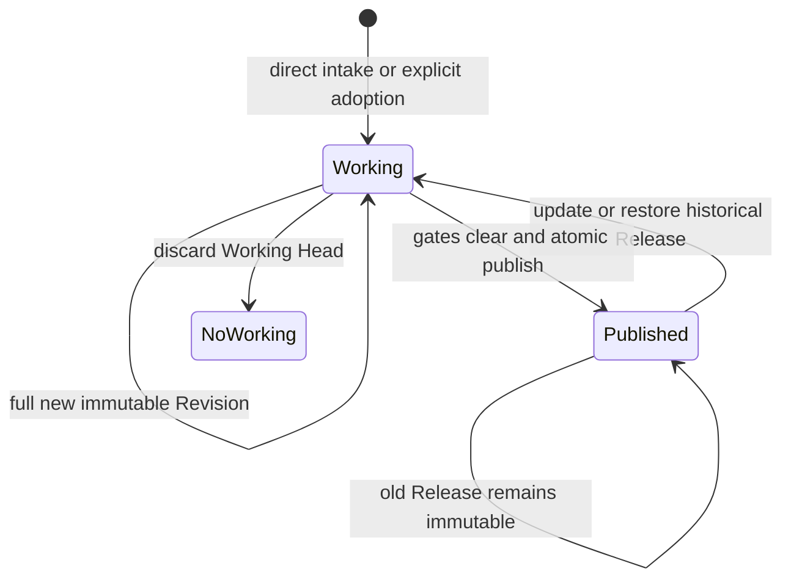

# Global Library architecture (0.5)

This document defines the ScientificFigureLibrary 0.5 storage and identity
model. The standard core is a global, portable, immutable Library plus two
retrieval providers. It is not a project database and it is not a web-capture
system.

## Goals and non-goals

### Goals

- one user-selected Library shared across projects and MCP hosts;
- self-contained image, code, provenance, review, and Release records;
- immutable history and exact materialization;
- deterministic plan/apply writes with stale-state and replay checks;
- portable backup, restore, fork, and template exchange boundaries;
- extension points for explicit intake adapters such as CiteBox;
- unified search across Local Published and FigureYa without mixing authority.

### Non-goals

- executing or validating scientific plotting code;
- silently selecting a Library from a current project;
- project pins or a project-specific authoritative Library;
- treating upstream publication as local approval;
- exposing Working, Capture, or unadopted legacy entries in ordinary search;
- direct CiteBox SQLite access;
- registering Web Capture tools in the standard 0.5 server.

## Identity layers

SFL deliberately separates four identities:

1. **Library identity** — UUID `libraryId` in `library.json`.
2. **Series identity** — stable `templateId` across revisions.
3. **Local Published identity** — exact `templateId + revisionId +
   contentDigest + releaseId`.
4. **Provider identity** — `providerId + exactSelector`, required whenever a
   Local Published or FigureYa candidate leaves search.

A title, filename, source path, visual similarity, or bare `templateId` is not
an exact cross-provider identity.

## Locator and resolution order

The locator is machine-local because it contains a native absolute path. The
Library content is portable because it uses relative POSIX paths.

Locator paths:

- Windows: `%APPDATA%\ScientificFigureLibrary\locator.json`
- Linux/WSL: `$XDG_CONFIG_HOME/scientific-figure-library/locator.json`, falling
  back to `~/.config/scientific-figure-library/locator.json`

Runtime resolution order:

1. an explicit internal runtime root argument;
2. `FIGURE_LIBRARY_DIR` environment override;
3. the user locator;
4. legacy `~/.figure-library`, read-only.

The locator uses schema `figure-library.locator.v2` and records
`configRevision`, `libraryId`, `libraryDirectory`, and `updatedAt`. Locator and
root marker `libraryId` values must agree. `configRevision` joins `libraryId`
in write-plan context so rebinding makes old plans stale.

Global binding is a non-writing plan followed by confirmed Apply. It never
infers the current project, and an environment override cannot be bypassed by
writing a conflicting locator.

## Portable storage layout

```text
<root>/
├── library.json
├── store/
│   ├── templates/<templateId>/
│   │   ├── series.json
│   │   ├── revisions/<revisionId>/
│   │   │   ├── content.json
│   │   │   └── assets/<logical asset paths>
│   │   ├── reviews/<reviewId>.json
│   │   └── releases/<releaseId>.json
│   ├── operations/
│   │   ├── intents/
│   │   └── receipts/public-materializations/<providerId>/<operationId>.json
│   ├── imports/<adapterId>/<importId>/receipts/<receiptId>/
│   ├── migrations/flat-v1/<bindingId>/
│   ├── exports/
│   └── quarantine/
├── indexes/
└── locks/
```

| Path | Authority | Backup/migration policy |
| --- | --- | --- |
| `library.json` | authoritative root identity and format | include |
| `store/templates/` | authoritative Series, content, assets, review, Releases | include |
| `store/operations/` | authoritative idempotency/recovery evidence | include |
| `store/imports/` | authoritative adapter receipts and manifests | include |
| `store/migrations/` | authoritative migration evidence and staged legacy input | include |
| `store/exports/` | authoritative export receipts when present | include |
| `store/quarantine/` | retained exceptional records | include |
| `indexes/` | derived, rebuildable | exclude from canonical full backup |
| `locks/` | runtime coordination only | exclude; never transfer as content |

The root marker schema is `figure-library.root.v1`. Storage format 1.0 uses
layout `figure-library.store-layout.v1`, relative POSIX paths, SHA-256, and RFC
8785 canonical JSON. `requiredCapabilities` allows a future reader to fail
closed when it cannot implement a required storage feature; 0.5 requires none.
`extensions` is the reserved root-level extension map.

Portable components reject traversal, absolute persisted paths, unsafe path
segments, symlinks at trust boundaries, Windows-reserved names, and
case-folding collisions. Migration must copy authoritative content rather than
reuse runtime locks.

## Immutable lifecycle

Canonical schemas:

- `figure-library.template-series.v1`
- `figure-library.template-content.v1`
- `figure-library.review-snapshot.v1`
- `figure-library.template-release.v1`



`series.json` is the small mutable pointer record. Content Revisions, Review
Snapshots, and Releases are immutable objects. A Series has at most one
Working Head and one Published Head. Every Working save creates a complete new
Revision rather than a generic JSON Patch or in-place edit.

Approval and publication are one atomic operation: create the immutable Release
and move the Published Head under the cross-runtime write lock. The prior
Release remains addressable. Historical restoration creates another Working
candidate and must pass current review; it never rewinds Published directly.

Review distinguishes:

- structural/semantic Validation Errors;
- open Blocking Review Gates;
- non-blocking Review Warnings.

There is no waiver in 0.5. Validation errors and open gates block publish.
Working and Published Reviews are read separately. A Published candidate loads
the immutable Review Snapshot named by its Release, so warnings remain visible
after the Working Head is cleared or a newer Working Revision exists.
Lifecycle plan/apply responses expose one `reviewSummary` containing errors,
open gates, warnings, publish eligibility, canonical decision, and validation
state.

A Working preview is selected only by exact `templateId + revisionId +
contentDigest`. Before Apply it may resolve the latest session-local pending
Working plan for that Series; after Apply it resolves the matching current
Working Head. Newer pending plans make prior selectors stale. It is read-only
and creates neither a preview receipt nor materialization authority.

## Direct-intake Figure Unit

The Agent observes host files and proposes a Figure Unit. SFL verifies regular
non-symlink bytes, hashes them, copies them into the immutable Revision, and
records a receipt. Original absolute source paths are not persisted in public
content.

A Figure Unit contains:

- one or more visuals and one canonical `primaryPreview`;
- an optional `canonicalPreviewDecision`
  (`default_uploaded_source`, `only_visual_available`,
  `user_selected_source`, or `user_override_rendered`);
- explicit visual roles (`source_reference` or `rendered_output`);
- an explicit multi-image grouping when needed;
- `visual_reference` or `plot_template` asset kind;
- for a plot template, code assets, code origins, a user-selected canonical
  implementation, and evidence-backed many-to-many figure-code links;
- provenance, annotations, review findings, and three-part validation state.

Relationship values are `user_supplied_pair`, `author_provided_original`,
`visual_inference`, `adapted_from_template`, and `generated_output`. Code origin
values are `user_supplied`, `author_provided`, `agent_generated`, and `adapted`.

`visual_inference` is always `scaffold` / `not_run`; it is inspired by a visual,
not reproduced from original data. `plotExecution.passed` requires a rendered
output, a generated-output relationship, and evidence. SFL itself never
generates this evidence because it does not execute code.

Canonical preview selection defaults to the sole `source_reference`; if only
one visual exists it selects that visual. Multiple sources or multiple
rendered-only visuals without an explicit choice are ambiguous. Selecting a
rendered output while any source exists requires a user-confirmed reason.
Legacy content without `canonicalPreviewDecision` remains readable.

The Host must declare every uploaded original as a `source_reference` in
`visualAssets`. Version 0.3.0 has no separate upload digest manifest, so the
Server cannot detect an original that the Host omitted entirely.

`figure-library.validation-state.v1` separates:

- `plotExecution`: `not_run|passed|failed`, with data scope and optional
  evidence; `passed` requires evidence;
- `upstreamWorkflow`: `unknown|not_run|partial|passed|failed|not_applicable`,
  with scope/evidence required for `partial|passed|failed`;
- `scientificValidation`:
  `not_assessed|limited|validated|rejected|not_applicable`, with a user or
  external-review decision source and an assessment reference/evidence asset
  required for `limited|validated|rejected`.

Legacy `executionStatus` remains the plot-status projection. A legacy
`passed` reads as plot passed with unknown scope, upstream unknown, and
scientific not assessed; it does not prove an upstream replay or scientific
conclusion.

Host Agent assessment and user decisions are stored separately. The server
performs deterministic validation only and never invokes the Host Agent.

## Intake adapters

Adapters enter through `store/imports/<adapterId>/<importId>/`. An immutable
import receipt binds:

- adapter and import identity;
- source-manifest digest;
- target template/revision/content identity;
- required asset SHA-256 values;
- self-contained asset inventory and commit time.

The default adapter is `user-upload`. CiteBox uses an explicit adapter such as
`citebox`; the host must acquire selected figures through CiteBox API, MCP, or
an explicit export. It must not access CiteBox SQLite. Preserve the selected
Figure ID, DOI/title, label, page, caption, export hash, and retrieval time
whenever available. External authority is provenance only: an adapter import is
Working and requires local review.

Future adapters can add manifests under their adapter namespace without
becoming ordinary retrieval providers. Provider registration is a separate
contract.

## Retrieval providers

The standard provider IDs are:

- `org.scientificfigurelibrary.local`
- `org.figureya.module`

Unified search ranks candidates from both providers together but reports
per-provider counts and retains provider-qualified identity. Local search reads
only current Published Heads. FigureYa search uses the bundled catalog and
commit-pinned archive identities. Same-named provider results coexist.

Local exact selectors bind template, revision, content digest, and Release.
FigureYa exact selectors bind module, source commit, archive commit, archive
hash/size identity, and materialization mode. Non-archived FigureYa catalog
entries may be described or previewed from their source identity but cannot be
materialized as if an archive existed.

Search ranking is not review. Local Published candidates inherit warnings
from the Review bound by the exact Release and display plot, upstream, and
scientific summaries separately. FigureYa's upstream-published state is
distinct from SFL local approval. Its plot state remains `not_run`, upstream
state `unknown`, and scientific state `not_assessed` unless separate local
evidence is ingested and reviewed as a local template.

## Materialization and project reproducibility

Materialization is an explicit plan/apply operation against a provider and
exact selector. The target `<destination>/<templateId>` must be absent.

```text
<target>/
├── TEMPLATE.md
├── template.json
├── template.lock.json
├── assets/{visuals,code,references,evidence}/...
└── upstream/...              # FigureYa only
```

`template.lock.json` is the project reproducibility boundary. It records the
provider-qualified identity, operation/plan binding, and output inventory. It
replaces project pins: any project can materialize from the same global
Library, while the project records exactly what it used.

The target lock is portable provenance, not proof that a server Apply occurred.
Durable idempotent replay additionally requires the immutable authoritative
Receipt under `store/operations/receipts/public-materializations/`. That Receipt
binds the public plan digest, operation ID, planned and resolved exact selectors,
complete target inventory, and a digest of the physical target path without
persisting the absolute path. Replay rechecks the current reachable Local
Release or current FigureYa Catalog as well as every target byte. A copied or
forged target lock without this Library Receipt cannot be replayed as success.

Local assets are copied into `assets/`. FigureYa retains an untouched
`upstream/` module and also builds a normalized asset envelope. Adaptations
belong in separate project files.

## Legacy migration and adoption

Legacy flat `figure-library.template.v1` content is not silently upgraded.
Global binding may stage a non-destructive `copy_legacy` snapshot under
`store/migrations/flat-v1/<bindingId>/source/` and write a receipt. Staging
does not make an entry searchable.

Each desired entry is adopted through an explicit plan/apply operation. The
adoption creates immutable versioned objects and a migration receipt while
retaining legacy input. If legacy review state cannot meet current gates, it
remains Working rather than being silently treated as approved.

## Backup, restore, fork, and template bundles

`src/portable-bundles.ts` implements the storage operations and
`src/bundle-tools.ts` exposes explicit MCP plan/apply contracts for:

- full backup plan/export;
- exact Published-template bundle plan/export;
- full restore plan/apply;
- full fork plan/apply;
- Published-template bundle import plan/apply.

The registered pairs are:

- `figure_library_plan_bundle_export` /
  `figure_library_apply_bundle_export`;
- `figure_library_plan_full_restore` /
  `figure_library_apply_full_restore`;
- `figure_library_plan_template_bundle_import` /
  `figure_library_apply_template_bundle_import`.

Each Apply receives the visible `planDigest` and a stable `operationId` in the
same server session. A bounded in-memory cache lets text-only Host bridges
Apply without reconstructing hidden JSON. Client-authored opaque plans are not
accepted. Bundle-export Apply also echoes the visible absolute
`expectedTarget`. Before writing that target, the Library persists an immutable
intent containing only its path digest and the exact plan/bundle/inventory
digests. Cache loss is terminal `plan_not_available` unless that intent plus a
complete byte-verified target can deterministically roll forward the missing
receipt after restart.

Full backup includes `library.json` and authoritative `store/` content while
excluding `indexes/` and `locks/`. Every bundle contains an inventory and
digest. Targets must be absent; operation IDs and receipts make Apply
idempotent and stale source inventories fail closed.

- **Restore** preserves `libraryId`, because it transfers the same authority,
  and requires explicit `authorityTransferConfirmed`.
- **Fork** creates a new `libraryId` and records `forkedFromLibraryId`, because
  it creates a distinct authority.
- **Published-template import** validates the exact source Release but creates
  a local Working Revision. Source approval is recorded as provenance and is
  not inherited.

## Concurrency, recovery, and anti-loop behavior

All writes use a cross-runtime Library write lock and include Library context.
An operation intent plus immutable receipt supports recovery and idempotent
replay around the small mutable Series pointer. A live or uncertain lock is
never automatically stolen.

Write-lock recovery has its own read-only plan and confirmed Apply. Every
Wisp, Codex, Claude, and other writer must be stopped first. Recovery archives
the unchanged abandoned lock and writes a receipt.

Public tools return `figure-library.tool-outcome.v1` with `terminal: true` and
`retrySameCall: false`. A Host Agent must branch on `outcome`, `code`, and
`nextAction` rather than retrying identical calls. A missing or expired cached
plan requires a new plan; a stale plan requires new review; missing user
decisions require a question; an acquisition failure is a hard stop.

This terminal contract is also usable when a host bridge exposes only MCP text
content. Hidden `structuredContent` must be treated as unavailable, never
reconstructed or claimed.

## Evolution rules

Future formats should preserve these invariants:

- unknown required capabilities fail closed;
- schema versions and provider IDs are explicit;
- authoritative objects remain self-contained and content-addressed;
- new adapters do not implicitly become trusted search providers;
- new index formats remain rebuildable;
- new runtime locks remain excluded from migration;
- any approval transfer remains explicit and auditable;
- deprecated experimental surfaces, including Capture, remain isolated unless
  separately reviewed and deliberately promoted.
