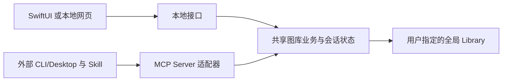

# 本地图片—代码知识库客户端

状态：0.8.0 已实现原生 SwiftUI 客户端、独立本地网页和内置 Node 的打包入口，作为预览版分发。
安装步骤与签名限制见 [安装说明](INSTALL_LOCAL.md)，验证范围见 [实施记录](LOCAL_CLIENT_IMPLEMENTATION.md)。

## 产品定义

SFL 是本地图片—代码知识库客户端。用户在本机管理图片、代码、两者的关联及其说明、
来源和版本；外部 CLI/Desktop 通过 MCP 和一个核心 Skill 调用同一知识库，获取候选
图片列表、查看精确资产并使用相关代码。具体研究任务与代码执行由宿主 Agent 承担。

该定义遵循用户本次明确归纳，取代此前只把产品当作 MCP App 或要求双端原生 UI 的
设想。详细职责边界见 [产品原则](PRODUCT_PRINCIPLES.md)。

本地 App 保持简单：不内置 AI、模型调用、聊天助手或 Agent 任务编排。MCP 与 Skill
是外部 CLI/Desktop 的接入方式，本地界面直接调用共享业务服务，不经过内部 MCP Client
或 MCP 代理。

## 客户端与接入形态

| 部分 | 确定方向 | 责任 |
| --- | --- | --- |
| macOS 本地客户端 | SwiftUI 原生 App，必要时使用 AppKit | 本地知识库浏览、管理、搜索、预览、选择及系统交互 |
| Windows 本地客户端 | 内置 Node 运行时启动本地 HTTP 服务，在浏览器打开 Web 页面 | 复用现有 Web UI，承接本地知识库操作；现阶段不开发 WinUI 3 |
| 共享后端 | 现有 TypeScript/Node 服务 | 图片—代码关联、元数据、Library、Provider、检索、精确身份和写入规则 |
| MCP | 面向外部 CLI/Desktop 的工具与资源接口 | 返回候选列表、图片与精确选择，提供知识库操作能力 |
| 核心 Skill | 一个 `figure-library/SKILL.md`，详细资料按需加载 | 指导宿主调用接口和衔接后续任务 |
| 简化 MCP App | 部分支持 MCP App 的宿主中的可选界面 | 候选浏览、简要预览、选择和交接 |

两种本地界面共用后端规则和用户明确指定的全局 Library。“共用后端”首先指共用实现
与数据契约，并不自动表示所有宿主共用一个进程或一组会话凭据。

业务层负责查询、资产读取、计划与确认、写入以及结果集和凭据状态；接口适配器只负责
传入请求和返回结果。共享操作使用普通函数和输入校验，不进行内部 MCP 初始化、消息传输
或工具发现。本地客户端可以独立运行，外部 MCP 服务及其 SDK 继续保留。

## 安装与运行时

目标是让最终用户无需另行安装 Node.js 或 npm：

- macOS App 携带经过验证、与目标架构匹配的私有 Node 运行时和已构建后端。
  SwiftUI 负责原生界面，后端继续运行 TypeScript 构建产物。
- Windows 插件携带 `node.exe`、后端、Web 构建产物、核心 Skill 和必要资源。
  启动配置使用包内运行时的路径，打开本机服务提供的网页。
- 按操作系统和处理器架构打包，记录运行时版本、来源、校验信息和许可。
  应用升级同时负责更新其内置运行时。
- 程序文件和运行时属于安装包，用户知识库位于用户指定目录；升级程序不迁移或
  覆盖权威 Library。绑定与定位继续使用现有规则，不能因新增客户端生成另一份图库。

本地客户端安装包使用内置 Node 22.23.2；通用的旧式 MCP 插件包仍保留系统 `node` 启动方式。
两种分发方式的配置不要混用，客户端设置可以复制使用包内运行时的 MCP 配置。

## 现有 UI 的复用方式

[现有界面入口](../app/main.ts) 通过 `App.connect()`、宿主工具调用与
`updateModelContext` 接收候选、预览及交接。独立网页入口为 `app/local-app.html`，通过本地 API 直接调用共享业务服务。

- Windows：拆出独立网页入口，复用卡片、详情、样式和交互逻辑，以本地服务连接
  替换宿主桥接；补充独立搜索、目录绑定和知识库管理的输入与状态。
- macOS：复用资产数据、图标、字段含义和交互规则，用 SwiftUI 实现界面。
  HTML/CSS 和 DOM 控件不作为原生控件直接复用。
- MCP App：共享适用的候选交互组件，保持精简；不以它承载完整本地客户端。

本地界面应可独立浏览与管理知识库；只有请求 Agent 完成研究任务时才需要对应宿主。
普通检索与管理视图仍需遵循 Published 与 Working 的既有可见性边界。

## 调用、会话和确认

外部 Agent 检索后，候选图片可在宿主、本地客户端或简化 MCP App 中展示。无论在哪个
界面选择，都保留 `providerId` 和 `exactSelector`，并把结果对应到发起选图的会话。

现有 `resultSetId`、challenge、receipt 和待应用计划有会话边界。浏览器或原生窗口
不能复制另一个会话的凭据来继续操作。独立界面的直接预览确认，以及用户选择回传
外部 Agent 的机制，已提供 `local` 确认契约与隔离测试；复制模板信息不转移其他会话的凭据。不能伪造 Agent 看图或 App 加载事实。

精确预览、明确选择、一次性确认、Plan/Apply、过期检查和重放语义继续适用。
SFL 不执行用户或模板代码，材料化成功不代表绘图执行或科学验证成功。

Windows 网页连接本机服务，需要限定本机监听、来源和会话访问范围，并只暴露获准的
资产与操作入口。首次打开、重复打开、浏览器关闭、MCP 断开及服务退出的行为应明确定义。
当前本地 API 使用 loopback、一次性连接凭据和会话认证；页面退出会关闭其本地服务。

## 实现与后续验收范围

1. 抽离共享服务入口与界面连接层，补充独立客户端的会话及确认契约。
2. Windows 实现内置运行时、独立 Web 页面和插件启动流程。
3. macOS 实现 SwiftUI 客户端、私有运行时启动及原生安装分发。
4. 将 MCP App 收敛为简化候选交互入口，并同步核心 Skill 和宿主配置。
5. 在未预装 Node 的目标系统验证安装、首次绑定、选图、交接、材料化、退出和升级；
   本地临时测试通过与真实宿主验收分别报告。

预览版已提供 DMG 和 Windows ZIP 的构建与平台 smoke。正式签名分发、完整人工体验验收及
更丰富的知识库编辑交互仍需继续完善；以每次发布附带的验证报告为准。
