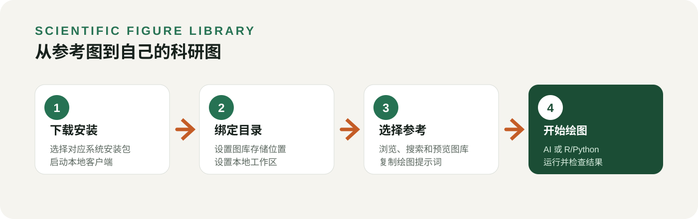

# 找到参考图，也找到绘图代码：SFL 下载安装与使用教程

做科研绘图时，我们经常遇到这样的情况：看到一张合适的图，收藏了截图，却找不到对应代码；翻出以前写过的脚本，又记不清它最终画出来是什么样子。

如果能把**参考图、绘图代码和使用说明放在一起**，下次作图时先选参考，再把材料交给 AI 或自己修改，整个过程就会清楚很多。

Scientific Figure Library，简称 **SFL**，就是这样一个本地图片—代码知识库。你可以用它浏览外部图库，也可以保存自己的图和代码，在不同项目中重复使用。

这篇教程以 **v0.8.0** 为例，从下载安装开始，走完“找到参考图 → 复制绘图提示词 → 用自己的数据作图”的流程。

**先明确一件事：SFL 负责管理和提供参考材料，实际修改代码、运行 R/Python 和生成图片，由你使用的 AI 编程工具或你自己完成。**



*图 1｜SFL 的基本使用路径：先把参考材料整理好，再交给 AI 或本地绘图环境执行。*

**01｜下载：第一次用，选内置运行环境的版本**

打开官方下载页：

[Scientific Figure Library v0.8.0 下载](https://github.com/xuzhougeng/ScientificFigureLibrary/releases/tag/v0.8.0)

在页面下方的 **Assets** 中，按电脑系统选择文件：

- **Windows 64 位电脑**：`ScientificFigureLibrary-0.8.0-windows-x64.zip`
- **苹果 M 系列芯片电脑**：`ScientificFigureLibrary-0.8.0-macos-arm64.dmg`
- **Intel 芯片 Mac**：`ScientificFigureLibrary-0.8.0-macos-x64.dmg`
- **Linux 电脑**：按架构选择 `linux-x64.zip` 或 `linux-arm64.zip` 结尾的包。

Mac 用户可以在“苹果菜单 → 关于本机”中查看芯片信息，macOS 客户端要求 macOS 13 或更新版本。

**初次使用，建议下载文件名里不带 `no-node` 的版本。** 这些包已经包含运行 SFL 所需的 Node.js，不用另外安装 Node.js 或运行 npm 命令。

带 `no-node` 的包适合已经安装 Node.js 22+ 的用户。名称中带 `codex`、`claude`、`cursor`、`wisp` 的 ZIP 是对应工具的插件包；按照本文使用独立客户端，选择上面的系统安装包即可。页面底部的 “Source code” 则是项目源码。

**02｜安装：Windows 解压启动，Mac 拖入应用程序**

**Windows 的操作：**

1. 将下载的 ZIP 完整解压到一个固定位置，例如 `D:\Apps\SFL`。
2. 打开解压后的文件夹，双击 **`Start SFL.cmd`**。
3. 程序会启动本地服务，并在默认浏览器中打开 SFL 页面。

如果浏览器没有自动打开，把启动窗口里显示的地址复制到 Edge 或 Chrome 即可。

虽然界面显示在浏览器里，但服务运行在你的电脑上。**使用期间保留启动窗口**；结束时点击界面中的“退出本地客户端”，再关闭网页。不要单独移动启动脚本或安装文件夹中的其他文件。

**macOS 的操作：**

1. 打开下载的 DMG。
2. 将 **Scientific Figure Library.app** 拖入“Applications／应用程序”。
3. 从应用程序中打开 SFL。

当前 macOS 包为预览版，尚未经过 Developer ID 签名和 Apple 公证。如果系统阻止首次打开，先确认来自官方发布页，并核对同名 `.sha256` 文件中的校验值，再按“系统设置 → 隐私与安全性”中的提示允许该应用。

**Linux 的操作：**

完整解压对应架构的 ZIP，在解压目录中运行 `./start-sfl.sh`。程序会尝试打开浏览器；没有自动打开时，复制终端显示的地址访问。使用期间保留终端。

**03｜首次设置：给图库选一个长期保存的位置**

打开 SFL 后，进入 **“设置”**，填写两个本机目录：

- **图库存储位置**：长期保存图片、代码和参考缓存，方便跨项目复用。
- **本地工作区**：保存本地工作内容，建议与图库目录分开。

例如，Windows 用户可以分别填写：

```text
图库存储位置：D:\SFL\Library
本地工作区：D:\SFL\Workspace
```

Mac 用户可以使用自己的用户目录，例如 `/Users/你的用户名/SFL/Library` 和 `/Users/你的用户名/SFL/Workspace`，将“你的用户名”替换为实际用户名。

点击 **“检查并确认目录”**，根据界面提示依次确认。这里填写的是完整路径，不是文件夹名称。

建议把这两个目录放在稳定的位置。以后升级 SFL 时替换程序即可，自己的图库和工作区应继续保留。

**04｜找到参考图：先看效果，再看它需要什么数据**


*图 2｜图库展示示意：热图、火山图、生存曲线、t-SNE 等参考图可集中浏览。此图用于说明图库形式，实际客户端界面以当前版本为准。*

进入 **“图库”** 页面，可以浏览图片，也可以输入关键词筛选。比如：

- 差异表达：试试 `volcano`。
- 热图：试试 `heatmap`。
- 细胞组成：试试 `celltype` 或 `stacked`。

SFL 可以检索本机已发布的图，以及 FigureYa、Open Figure Modules 等已启用来源。实际结果取决于当前启用的图库和目录版本。

找到感兴趣的图片后，打开详情。除了样式，建议重点看三个方面：**它表达什么问题、输入数据是什么结构、有没有配套代码。**

例如，同样是堆叠柱状图，有的按样本展示比例，有的先按组汇总。外观接近，并不代表可以直接套用同一份数据。

首次查看在线图库时，图片需要下载。你可以先按需浏览，也可以进入 **“连接外部图库”**，对指定图库点击 **“缓存图片”**。已缓存图片可以在之后离线查看。

这里有两个容易混淆的按钮：**“缓存图片”准备预览图，“缓存参考包”准备代码等参考材料。** 看到了图片，不代表代码也已经下载到本机。

**05｜复制绘图提示词：把参考交给 AI**

选中合适的参考后，点击 **“复制绘图提示词”**，再粘贴到你使用的 AI 编程工具中。

提示词会列出该参考的图片、代码、说明文件路径，以及输入要求和来源。参考包尚未缓存时，SFL 会先下载固定版本的参考包，再完成复制。没有配套代码的条目会说明原因。

为了让 AI 知道这次要做什么，建议在复制的内容后面补充自己的数据路径和绘图要求。例如：

> 请先阅读上面列出的参考图、绘图代码和说明文件。
>
> 我的差异表达结果位于 D:\Projects\RNAseq\results\DEG.csv，包含 gene、log2FoldChange 和 padj 三列。
>
> 请检查数据是否适合这个火山图模板。横轴使用 log2FoldChange，纵轴使用 -log10(padj)，以 padj < 0.05 且绝对 log2FoldChange > 1 作为本次标记阈值。
>
> 如果发现缺失值或 padj 为 0，请先说明处理方法。保留参考图的主要风格，在项目中另存脚本，使用我的数据作图，并导出 PDF 和 300 dpi PNG。
>
> 完成后展示图片，说明使用了哪些数据列、阈值，以及是否有运行错误。

把示例中的路径、列名和阈值替换为你自己的内容。阈值只是本次示例，并不适用于所有研究。

**这一步最关键的是：AI 能否读取提示词中的本机文件。**

在同一台电脑上、有文件读取权限的 AI 编程工具，可以按路径读取参考材料。如果你使用网页聊天工具，或 AI 运行在另一台机器上，需要把提示词列出的相关文件上传过去；仅粘贴一个本机路径，远端 AI 无法获取文件内容。

另外，SFL 内置的 Node.js 只用于运行图库。真正执行 R 或 Python 绘图脚本，仍需要相应运行环境和依赖包。

**06｜想在 AI 对话里直接找图，可以连接外部工具**

用熟了手动浏览和复制提示词，再配置 MCP 也不迟。MCP 可以让支持它的 AI 工具直接搜索 SFL、展示候选图，并在你确认后获取模板。

在客户端侧边栏进入 **“连接外部工具”**：

1. 选择你使用的工具。
2. 按页面说明复制添加命令或 MCP 配置。
3. 在对应工具中完成配置。
4. 将页面提供的验证指令发给 AI，检查它是否能读取图库状态、展示候选图片。

这里生成的配置包含当前电脑上的真实安装路径，因此应先把 SFL 放在固定位置，再复制配置。

连接后，可以这样提出需求：

> 请在 SFL 中搜索适合差异表达结果的火山图，展示候选图片并说明区别。等我选定参考后，再确认保存位置，使用我的数据绘图。

如果已经通过插件接入同一服务，不要再重复添加一份原始 MCP 配置，以免出现重复工具。不同 AI 工具的图片展示能力也可能不同，应以实际验证结果为准。

**07｜把自己的成果存起来，下次继续用**


*图 3｜SFL 的核心思路是把图片、代码和说明放在一起，形成可复用的本地知识库。*

当你完成了一张满意的图，可以通过 **“创建参考图”** 入口，把图片、配套代码和说明收进自己的图库。

保存后的资产先作为草稿管理，在 **“我的图库”** 中检查内容、记录审阅情况，再发布为可检索的版本。这里的“发布”是发布到本机图库，不等于上传到互联网。

这样，下次遇到类似任务时，就能先找到图，再找到对应代码。需要调整时，在项目副本中修改；想把改进后的结果留作新参考，再导入和发布新版本。

**遇到问题，先检查这几处**

**图片一直加载不出来？**

首次下载需要能够访问图片来源。恢复网络后重新打开预览，或对该图库重新执行“缓存图片”。若你使用本机代理，可在“设置”中打开系统代理并填写实际 HTTP 代理地址，例如 `http://127.0.0.1:7897`；端口以自己的代理软件为准。

**复制了提示词，AI 仍然找不到文件？**

先确认 AI 是否运行在同一台电脑，并具有相应目录的读取权限。远程工具需要上传材料，或将文件放到它能访问的位置。

**拿到了代码，却没有生成图片？**

参考材料已经准备好，接下来还需要实际运行绘图脚本。让 AI 检查数据格式、R/Python 环境和依赖，并报告原始错误。模板下载成功不等于绘图运行成功。

**资料保存在本地，是否意味着整个过程离线？**

图库文件保存在你指定的本机目录，但外部图库下载和更新会联网。使用 AI 时，数据如何处理还取决于所用工具和模型服务。使用参考内容也应保留来源，并遵守对应许可证。

第一次使用，可以从一张熟悉的图开始：搜索参考，检查数据要求，复制提示词，用自己的数据运行一次。等这条流程走通，再把常用图和代码逐步整理进自己的图库。

项目与下载入口：

- [项目主页](https://xuzhougeng.github.io/ScientificFigureLibrary/)
- [获取最新版本](https://github.com/xuzhougeng/ScientificFigureLibrary/releases/latest)
- [本地客户端安装说明](https://github.com/xuzhougeng/ScientificFigureLibrary/blob/v0.8.0/docs/INSTALL_LOCAL.md)

本文依据 2026 年 9 月 18 日发布的 v0.8.0 编写，后续版本的界面和操作以实际客户端为准。
